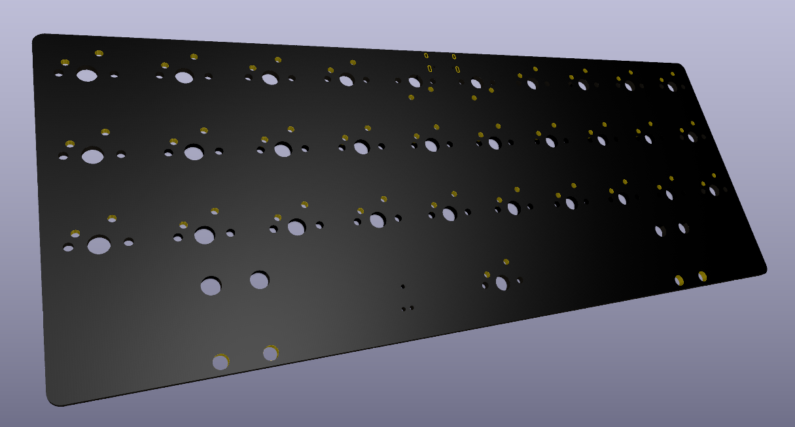

# Speedrun 40% PCB Keyboard Design with KiCAD

**Keyboard design is supposed to be hard, isn't it? No longer.**

## Features

- ARM microcontroller with 256k of flash, USB, and QMK/Vial support
- USB-C port with ESD protection
- 4-layer board design
- 6 pin tag connect port for SWD programming
- Easy and quick routing
